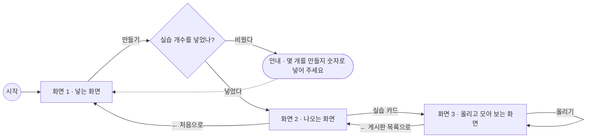

# 화면 흐름

```mermaid
flowchart LR
    START(("시작"))
    S1["화면 1 · 넣는 화면"]
    CHECK{"실습 개수를 넣었나?"}
    MSG(["안내 · 몇 개를 만들지 숫자로 넣어 주세요"])
    S2["화면 2 · 나오는 화면"]
    S3["화면 3 · 올리고 모아 보는 화면"]

    START --> S1
    S1 -->|"만들기"| CHECK
    CHECK -->|"넣었다"| S2
    CHECK -->|"비웠다"| MSG
    MSG -.-> S1
    S2 -->|"← 처음으로"| S1
    S2 -->|"실습 카드"| S3
    S3 -->|"← 게시판 목록으로"| S2
    S3 -->|"올리기"| S3
```
